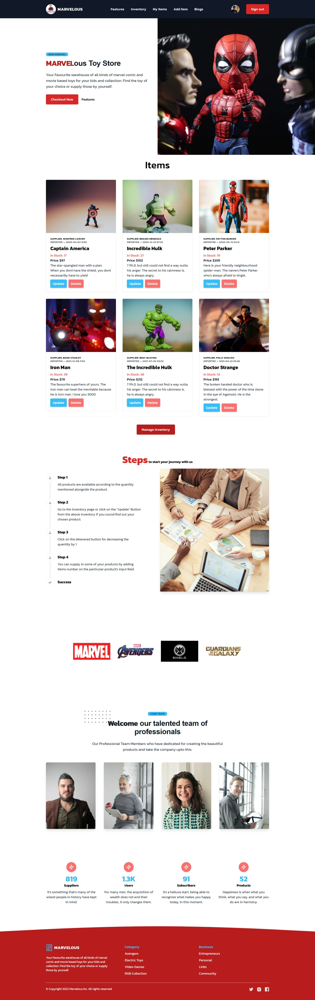

# MARVELous Toy Store

## Table of Contents

- [Overview](#overview)
  - [Screenshot](#home-page-preview)
  - [Links](#links)
- [My process](#my-process)
  - [Built with](#built-with)
  - [Features](#features)

----

## Overview

Welcome to my website on creating a warehouse management Website.

## Links

- Live Site Link: [Click Here](https://marvelous-toy-store.web.app/) to see the Live website.
- Client side Github Repo: [Click Here](https://github.com/ProgrammingHeroWC4/warehouse-management-client-side-kamrulsaad) to check my client side github repo for this project.
- Server side Github Repo: [Click Here](https://github.com/ProgrammingHeroWC4/warehouse-management-server-side-kamrulsaad) to check my server side github repo for this project.
- Stack OverFlow Question Link: [Click Here](https://stackoverflow.com/questions/72152573/why-my-tailwind-components-library-flowbite-is-not-working/72160666#72160666) to check my question on stack overflow.

## Home Page Preview

----

## My Process

I have built this website following the requirements provided.

## Built With

- `react`, `react-dom`
- `react-router`
- `firebase`
- `react-firebase-hooks`
- `tailwindCSS`
- `tw-elements`
- `tailgrid` 
- `kitwind UI`
- `sweet alert`
- `react-toastify` 
- `jwt`
- `node`
- `mongoDB`
- `cors`
- `express`
- `heroku`
- `imgbb`
- `photopea`
- `tinypng`
- `framer-motion`

------

## Features

Users should be able to:

- See a Beautiful home page
- Log in using google account
- Create account with Email and password 
- Recieve email for email-verification and resetiing password
- Browser through different pages with great user experience
- Add Item to the database
- By clicking on delevered button, product quantity will be decreased by 1
- Restock items quantity by entering the amount in input field
- Check the items added by the particular user
- Delete item from the inventory
- Have to accept the terms and conditions for creating an account
